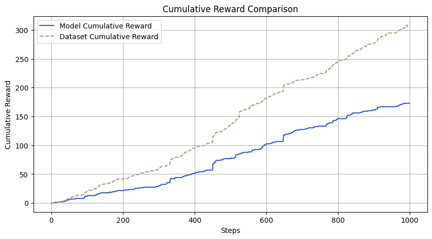
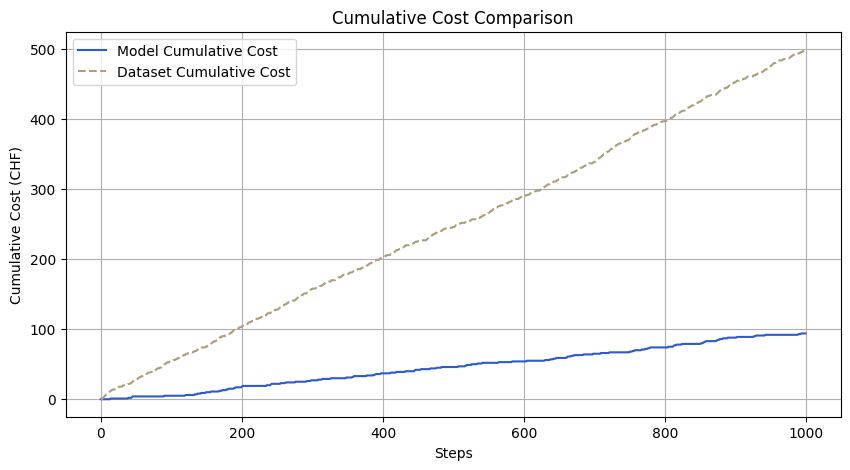
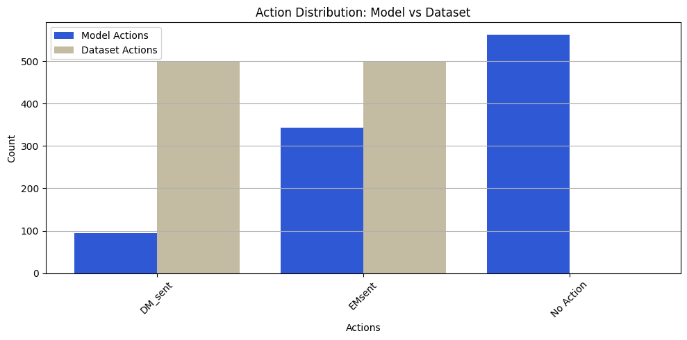

# Deep Reinforcement Learning for Sales Channel Contact Optimization

## Overview

This project explores how Deep Reinforcement Learning (DRL) can be applied to optimize customer engagement across different sales channels.  
The goal is to determine the most effective sequence of communication methods (Email, Direct Mail etc.) that lead to increased sales while reducing spam, minimizing customer unsubscriptions and lowering overall contact costs.  
By using reinforcement learning, we can create a smarter and more efficient contact strategy that prioritizes meaningful interactions over excessive messaging. 

To achieve this, I introduced **'No Action'** as a possible decision in our model, allowing the system to actively decide when not to contact a customer to avoid unnecessary outreach and costs.

## Problem Statement

Traditional marketing strategies often rely on static rules or heuristics to determine how and when to contact customers.  
However, customer behavior is dynamic and a one-size-fits-all approach can lead to suboptimal results.  
Excessive outreach can lead to increased costs and higher unsubscription rates, while insufficient engagement may reduce conversion rates. This project aims to leverage reinforcement learning to create a personalized strategy for each customer, learning from past interactions to maximize engagement and sales conversions while avoiding excessive unwanted contact and reducing operational costs. 

By incorporating **'No Action'** as an option, our model learns when to refrain from engaging with a customer, leading to a more efficient, cost-effective and less intrusive communication strategy.

## Why Deep Reinforcement Learning?

Deep Reinforcement Learning (DRL) is particularly well-suited for this problem because it allows an agent to learn optimal contact strategies dynamically through trial and error, rather than relying on static decision trees or predefined business rules.  
Unlike traditional machine learning approaches such as neural networks or random forest models, DRL provides the following advantages:

- **Sequential Decision Making**: Unlike a classification or regression model that predicts a single outcome, DRL considers the long-term impact of each decision, ensuring that short-term gains do not lead to long-term losses (e.g., excessive messaging leading to unsubscriptions).
- **Optimized Trade-offs**: The reward function in DRL ensures that the model balances engagement with the risk of spamming customers. It penalizes unnecessary contacts that receive no response while reinforcing behaviors that lead to successful conversions.
- **Handling Delayed Rewards**: Traditional models may struggle to associate long-term customer retention or eventual purchases with earlier outreach efforts. DRL naturally accounts for delayed rewards, making it more effective for optimizing sequences of actions.

By using DRL, this project enables a marketing strategy that evolves dynamically, reducing spam while maintaining high engagement, lowering unnecessary contact costs and maximizing revenue.

## Data and Notebooks

Since the full dataset is too large and specific to a company, only samples are provided for demonstration purposes.

### Data Files
- **`DRL_PreDataset_Subset.csv`** – A sample dataset containing historical interactions, including past engagement metrics and customer demographics.
- **`DRL_Training_Dataset_Subset.csv`** – A processed dataset formatted for reinforcement learning, structured with state-action-reward tuples.

### Notebooks
- **`Prepare_Training_Data.ipynb`** – Preprocesses the raw dataset, engineering features and transforming the data into a reinforcement learning-friendly format (State-Action-Reward).
- **`DRL.ipynb`** – Implements the training and evaluation of the reinforcement learning model using **Deep Q-Networks (DQN)**.


## Approach

1. **Data Collection & Preprocessing**

   - The dataset consists of past interactions, including customer responses to different communication channels.
   - Features include the number of previous contacts via each channel, time since last contact, customer demographics and engagement metrics.
   - A reward function is designed to reflect business objectives: sales count as strong positive reinforcement, unsubscriptions impose significant penalties and non-responsive contacts receive minor penalties to discourage excessive outreach while still encouraging attempts to engage inactive customers.

2. **State Representation & Action Space**

   - Each customer’s history is represented as a state vector, encoding past interactions and engagement history.
   - The action space consists of possible contact methods (e.g., send an email, make a call, etc.), including **'No Action'** as a valid decision.
   - The agent learns which actions lead to positive outcomes through trial and error, balancing the trade-off between engagement, spam avoidance and cost efficiency.

3. **Training the Model**

   - The model is trained using **Deep Q-Networks (DQN)**, a reinforcement learning algorithm that extends Q-learning with a neural network to approximate the Q-value function.
   - The neural network takes in customer state features and outputs Q-values for each possible action, learning the optimal policy by minimizing the difference between predicted and actual Q-values over time.
   - A carefully tuned reward function ensures that the agent prioritizes meaningful interactions over excessive messaging.
   - Training involves simulating thousands of customer interactions and updating the policy accordingly.

4. **Evaluation & Insights**

   - The trained model is tested on unseen customer data to validate its effectiveness.
   - Key performance metrics include conversion rates, unsubscribe rates, cost reduction and overall revenue impact.
   - The results help refine business strategies and personalize marketing efforts at scale.

## Model Training

The model was trained using Deep Q-Networks (DQN) on a dataset containing over 10 million observations/contacts and 1.9 million unique customers. The training process involved learning optimal contact strategies by balancing engagement, cost efficiency and customer response patterns. By continuously updating Q-values based on past interactions, the model refined its decision-making, prioritizing meaningful engagements while reducing unnecessary outreach.

## Model Evaluation

The evaluation demonstrates how the trained model improves contact efficiency and engagement while reducing unnecessary outreach. The results compare model performance with the original dataset-based strategy.

### Evaluation Metrics
```
Step: 0, Action: EMsent, Reward: 0.79, Exploration Bonus: 0.80, Total Reward: 0.79
Model Total Reward: 172.80 (Only for matched actions)
Dataset Total Reward: 305.49
Total Contacts in Model: 437 out of 1000
Total Contacts in Dataset: 1000 out of 1000
Difference in Contacts Between Model and Dataset: -563
Model Total Cost: 94 CHF
Dataset Total Cost: 500 CHF
Model Reward per Contact: 0.3954
Dataset Reward per Contact: 0.3055
Model Cost per Reward Point: 0.5440 CHF
Dataset Cost per Reward Point: 1.6367 CHF
Model Negative Reward Count: 220 out of 1000
Dataset Negative Reward Count: 752 out of 1000
'No Action' Wins (Avoided Bad Actions): 447 times
'No Action' Losses (Missed Good Actions): 116 times
```








These results highlight the benefits of reinforcement learning: fewer overall contacts, a more efficient engagement strategy, lower costs per reward point, and a significant reduction in negative customer interactions.  
By introducing 'No Action' as a decision, the model has successfully reduced unnecessary outreach, improving cost-effectiveness while avoiding unproductive contacts.  
The 47.3% decrease in total contacts and the 81.2% reduction in negative interactions demonstrate how reinforcement learning optimizes engagement without compromising effectiveness.  
Additionally, the model achieved a 66.8% reduction in cost per reward point, lowering costs from 1.6367 CHF in the dataset to 0.5440 CHF, ensuring a more resource-efficient approach to customer engagement.


### Model Application

The trained model predicts the optimal contact action for a given customer state.  
This approach enables a data-driven strategy to maximize engagement while staying within budget. 

Demonstration:
```
Predicted best action for state 959: No Action
Predicted best action for state 810: EMsent
Predicted best action for state 671: DM_sent
```

This prediction shows the actions selected by the model for a given state to maximize engagement and revenue while staying within performance and budget constraints.

## License

This project is licensed under the MIT License. See `LICENSE` for details.

